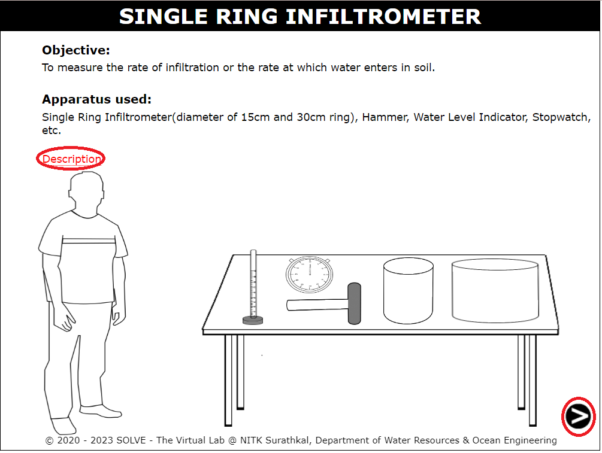
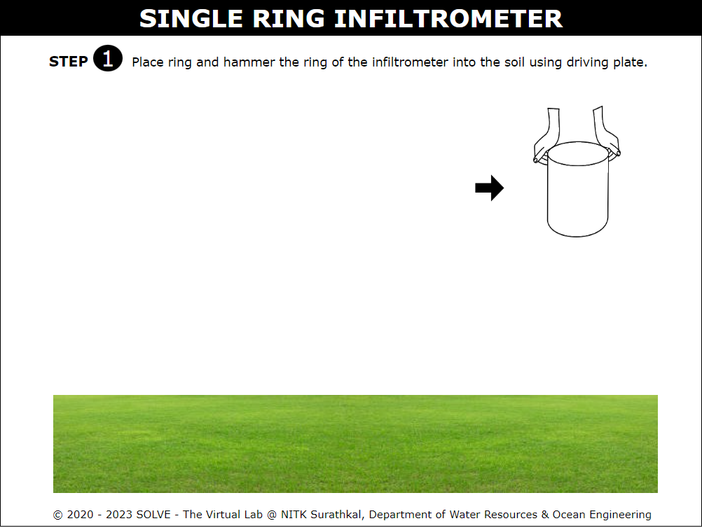
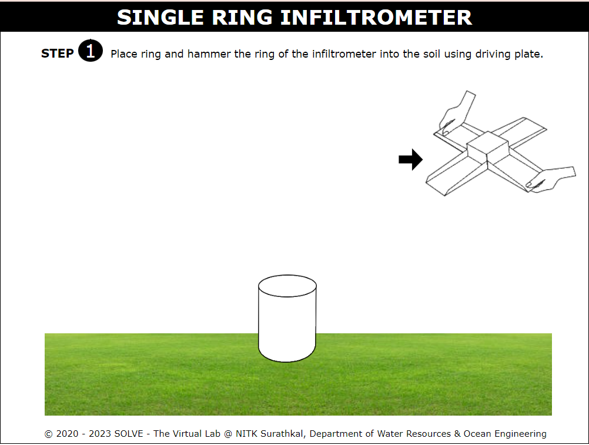
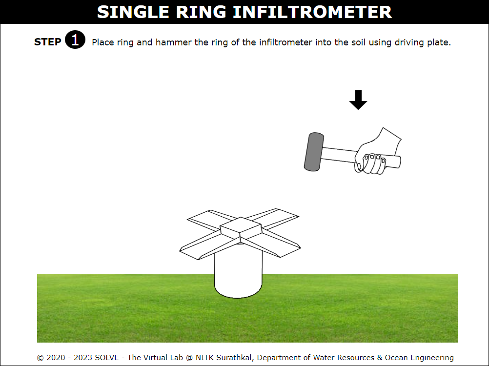

### Procedure

1. Open the single ring infiltrometer test and hover over the description to read the description, click on the arrow given in the bottom right corner to move to the next step.
   

2. Click on the given ring size options to select one. And click on the arrow given at the bottom right corner to move to the next step.
   

3. Click on the cylindrical ring to place the ring on the ground.
   

4. Next click on the driving plate to place it over the ring.
   

5. Next click on the hand to hammer the ring using the driving plate.
   

6. Now click on the driving plate to take off the driving plate from the top of the ring.
   

7. Then click on the arrow button given at the bottom right corner to move to the next step.
   

8. Click on plate to place it onto the water level indicator.
   

9. Next click on the water level indicator to place it into the center of the cylindrical ring infiltrometer.
   

10. Click on the arrow given at the bottom right corner to move to the next step.
    

11. Click on the bucket to pour water into the ring care should be taken to not to disturb the soil surface.
    

12. Answer the pop up question by selecting the correct option.
    

13. Click on the arrow given at the bottom right corner to move to the next step.
    

14. Click on stopwatch to start the timer. The water starts infiltrating into the soil.
    

15. Note down the readings from the observation table and click on the arrow given at the bottom right corner to move to the next step.
    

16. With the help of observations and given equations calculate the infiltration rate and cumulative infiltration and insert the values into the table then click on the check button to verify results.
    

17. Insert the average and accumulated infiltration depth values then click on the check button. And verify results by clicking on the results button.
    

18. Finally read the inference of the experiment and reload the page to repeat the experiment by selecting another ring size option.
    
